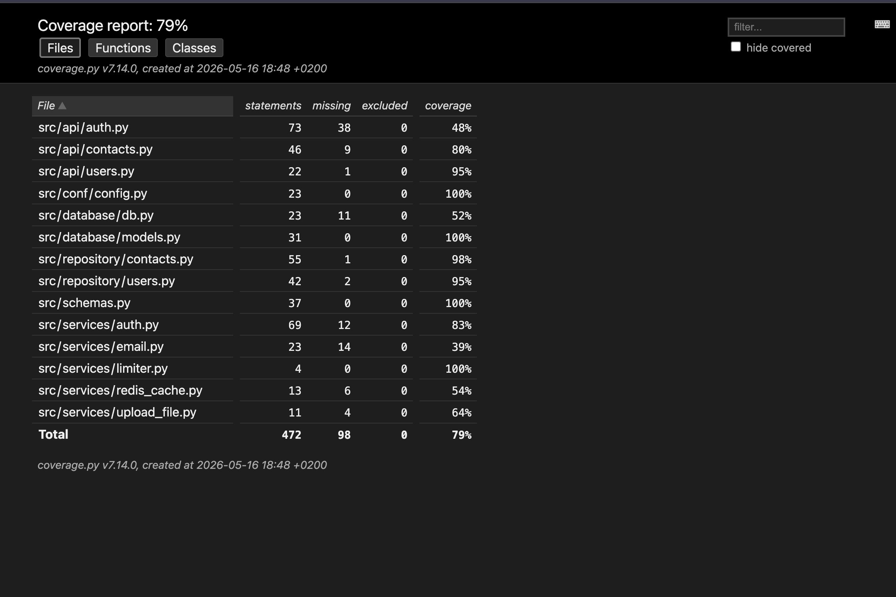

# Contacts API

Contacts API is a RESTful web application for managing personal contacts with authentication and user-based access control.

The project is built with FastAPI and includes JWT authentication, email verification, password reset, Redis caching, avatar uploads, rate limiting, Docker support, automated tests, and Sphinx documentation.

---

## Features

- User registration and authentication
- JWT access tokens
- Password hashing with bcrypt
- Email verification
- Resend verification email
- Password reset via email
- Redis caching for authenticated users
- Role-based access control (`user` / `admin`)
- Avatar upload with Cloudinary
- Rate limiting with SlowAPI
- CRUD operations for contacts
- Contact search by first name, last name, or email
- Upcoming birthdays endpoint
- Access only to personal contacts
- Asynchronous PostgreSQL operations
- Docker and Docker Compose support
- Unit and integration tests
- Sphinx documentation

---

## Technology Stack

- Python 3
- FastAPI
- SQLAlchemy Async
- PostgreSQL
- Alembic
- Pydantic
- JWT
- Redis
- SlowAPI
- FastAPI-Mail
- Cloudinary
- Pytest
- Docker
- Docker Compose
- Poetry
- Sphinx

---

## Installation

Clone the repository:

```bash
git clone <repository-url>
cd <project-folder>
```

Install dependencies:

```bash
poetry install
```

---

## Environment Variables

Create a `.env` file in the project root.

```env
DB_URL=postgresql+asyncpg://postgres:password@db:5432/contacts_app

JWT_SECRET=your_secret_key
JWT_ALGORITHM=HS256
JWT_EXPIRATION_SECONDS=3600

MAIL_USERNAME=your_email@example.com
MAIL_PASSWORD=your_password
MAIL_FROM=your_email@example.com
MAIL_PORT=465
MAIL_SERVER=smtp.example.com
MAIL_FROM_NAME=Contacts API
MAIL_STARTTLS=False
MAIL_SSL_TLS=True
USE_CREDENTIALS=True
VALIDATE_CERTS=False

CLD_NAME=your_cloudinary_name
CLD_API_KEY=your_cloudinary_api_key
CLD_API_SECRET=your_cloudinary_api_secret

REDIS_URL=redis://redis:6379
```

---

## Running the Application

### Run with Docker Compose

Build and start containers:

```bash
docker compose up --build
```

Run in background mode:

```bash
docker compose up -d
```

Stop containers:

```bash
docker compose down
```

---

## Database Migrations

Apply migrations:

```bash
docker compose exec app alembic upgrade head
```

Create a new migration:

```bash
docker compose exec app alembic revision --autogenerate -m "message"
```

---

## API Documentation

### Local

Application URL:

```text
http://127.0.0.1:8000
```

Swagger UI:

```text
http://127.0.0.1:8000/docs
```

ReDoc:

```text
http://127.0.0.1:8000/redoc
```

---

## Deployment

Application deployed on Render:

```text
https://contacts-fastapi.onrender.com/
```

Swagger documentation:

```text
https://contacts-fastapi.onrender.com/docs
```

---

## API Endpoints

### Authentication

- `POST /api/auth/register` — register user
- `POST /api/auth/login` — authenticate user
- `GET /api/auth/confirmed_email/{token}` — confirm email
- `POST /api/auth/request_email` — resend confirmation email
- `POST /api/auth/request_password_reset` — request password reset
- `POST /api/auth/reset_password/{token}` — reset password

### Users

- `GET /api/users/me` — get current user profile
- `PATCH /api/users/avatar` — upload avatar (admin only)

### Contacts

- `GET /api/contacts/` — get all contacts
- `GET /api/contacts/{contact_id}` — get contact by ID
- `POST /api/contacts/` — create contact
- `PUT /api/contacts/{contact_id}` — update contact
- `DELETE /api/contacts/{contact_id}` — delete contact
- `GET /api/contacts/search/?query=value` — search contacts
- `GET /api/contacts/birthdays/` — upcoming birthdays

---

## Example Contact Object

```json
{
  "first_name": "Anna",
  "last_name": "Ivanova",
  "email": "anna@example.com",
  "phone": "+31612345678",
  "birthday": "1995-05-10",
  "additional_data": "Friend"
}
```

---

## Authentication

Protected routes require a Bearer token.

Example:

```text
Authorization: Bearer your_access_token
```

Login endpoint uses form data:

```text
username=your_username
password=your_password
```

---

## Testing

Run tests:

```bash
poetry run pytest
```

Run tests with coverage:

```bash
poetry run pytest --cov=src tests/
```

Generate HTML coverage report:

```bash
poetry run pytest --cov=src tests/ --cov-report=html
```

Current test coverage:

```text
79%
```

Coverage includes:

- Repository unit tests
- Authentication tests
- Contacts routes tests
- Users routes tests
- Integration tests

---

## Sphinx Documentation

Build documentation:

```bash
cd docs
poetry run make html
```

Open generated documentation:

```bash
open build/html/index.html
```

---

## Project Structure

```text
src/
├── api/
│   ├── auth.py
│   ├── contacts.py
│   └── users.py
├── conf/
│   └── config.py
├── database/
│   ├── db.py
│   └── models.py
├── repository/
│   ├── contacts.py
│   └── users.py
├── services/
│   ├── auth.py
│   ├── email.py
│   ├── limiter.py
│   ├── redis_cache.py
│   ├── upload_file.py
│   └── templates/
├── schemas.py

tests/
docs/
migrations/

main.py
Dockerfile
docker-compose.yml
pyproject.toml
README.md
```

---

## Notes

- All sensitive data is stored in `.env`
- `.env` should never be committed to GitHub
- Passwords are stored only as hashes
- Redis is used for caching authenticated users
- Users can access only their own contacts
- Avatar uploads are handled with Cloudinary
- Only administrators can update avatars

## Testing

Run tests:

```bash
poetry run pytest
```

Run tests with coverage:

```bash
poetry run pytest --cov=src tests/
```

Generate HTML coverage report:

```bash
poetry run pytest --cov=src tests/ --cov-report=html
```

Current test coverage:

```text
79%
```

Coverage includes:

- Repository unit tests
- Authentication tests
- Contacts routes tests
- Users routes tests
- Integration tests

### Coverage Report

